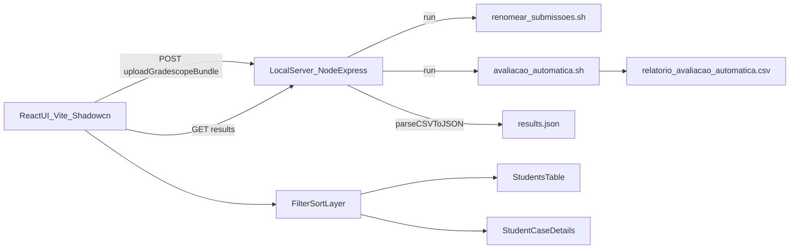

# Plano do Projeto Web de Avaliacao

## Contexto e objetivo

Construir uma interface web simples e visual para avaliar submissions de alunos, com filtros e ordenacao por desempenho, usando:

- Frontend: `Vite + React + shadcn/ui`
- Backend local: `Node + Express` (sem backend remoto)
- Pipeline existente: `renomear_submissoes.sh` e `avaliacao_automatica.sh`

Objetivo funcional:

- Upload da pasta exportada do Gradescope
- Botao "Avaliar" para executar pipeline local
- Visualizacao com filtros (errou alguma questao, erro de compilacao, faixa de nota, etc.)
- Detalhe por aluno/caso com `expected_output` vs `program_output`

## Viabilidade

Alta viabilidade e baixo risco tecnico para MVP, porque:

- Ja existe script de avaliacao automatica consolidado
- Ja existe CSV detalhado por caso
- O frontend pode focar em experiencia de uso e analise

## Arquitetura proposta

## Modelo de dados recomendado

Gerar um JSON agregado por aluno para facilitar filtros e ordenacao no frontend:

- `studentId`, `studentName`, `submissionDir`
- `compileErrorsCount`, `runtimeErrorsCount`, `timeoutsCount`, `waCount`, `okCount`
- `problem1Score`, `problem2Score`, `totalScore`
- `failedAnyQuestion`
- `cases[]` com:
  - `problem`, `case`, `status`, `details`
  - `expectedOutput`, `programOutput`

## Requisitos de interface (MVP)

Tabela principal com:

- Busca por nome/id
- Filtro "Errou alguma questao"
- Filtro "Teve erro de compilacao"
- Filtro por problema (`problem1`, `problem2`, ambos)
- Filtro por faixa de nota
- Ordenacao por:
  - nota total
  - nota do problem1
  - nota do problem2
  - quantidade de erros

Tela de detalhes por aluno:

- Lista de casos executados
- Status por caso (`OK`, `WA`, `TIMEOUT`, `RUNTIME_ERROR`, `COMPILE_ERROR`)
- Comparacao de saida esperada vs saida do programa

## Fluxo do usuario

1. Fazer upload da pasta baixada do Gradescope.
2. Clicar em **Avaliar**.
3. Acompanhar progresso da execucao.
4. Abrir dashboard com tabela e filtros.
5. Abrir detalhes de um aluno/caso.
6. Exportar resultados filtrados (CSV/JSON).

## API local sugerida

- `POST /api/upload`
- `POST /api/evaluate`
- `GET /api/status/:jobId`
- `GET /api/results/:jobId`
- `GET /api/download/:jobId`

## Plano de execucao por fases

### Fase 1 - Pipeline local e dados

- Definir formato de job (workspace temporario por execucao)
- Receber upload de pasta/arquivos e reconstruir estrutura
- Executar scripts de avaliacao no workspace do job
- Parsear CSV para JSON agregado

### Fase 2 - Dashboard MVP

- Tela de upload + botao avaliar
- Tabela com filtros e ordenacao
- Paginacao simples (se necessario)

### Fase 3 - Detalhamento e exportacao

- Painel de detalhe por aluno
- Exibicao de outputs esperado/programa por caso
- Exportacao de CSV/JSON (global e filtrado)

### Fase 4 - Robustez e UX

- Validacoes de ambiente (`bash`, `gcc`, permissao scripts)
- Tratamento de erro amigavel na UI
- Historico simples de jobs

## Backlog tecnico (todos)

- `definir-workflow-job`: definir contrato de job/status/results
- `normalizar-dados`: parser CSV -> JSON agregado
- `ui-mvp`: upload, avaliar, tabela com filtros/ordenacao
- `detalhe-aluno`: casos com expected/program output
- `robustez`: validacoes de ambiente, erros e exportacao

## Riscos e pontos de atencao

- Navegador nao executa shell diretamente; por isso backend local e obrigatorio
- Upload de pasta no browser usa `webkitdirectory` e exige reconstrucao de paths
- Evitar sobrescrever execucoes: usar `jobId` e diretorio isolado
- Sanitizar nomes de arquivos/pastas para seguranca

## Entregaveis finais esperados

- Aplicacao web local funcional
- Execucao de avaliacao com um clique
- Dashboard com filtros/ordenacao por desempenho
- Detalhes por caso com outputs
- Exportacao de resultados para analise externa
